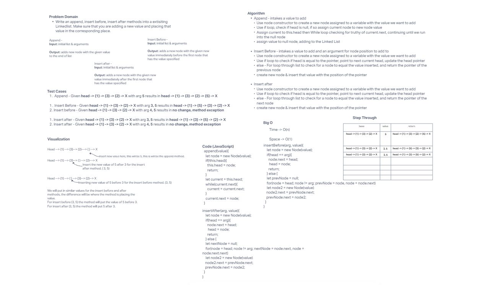
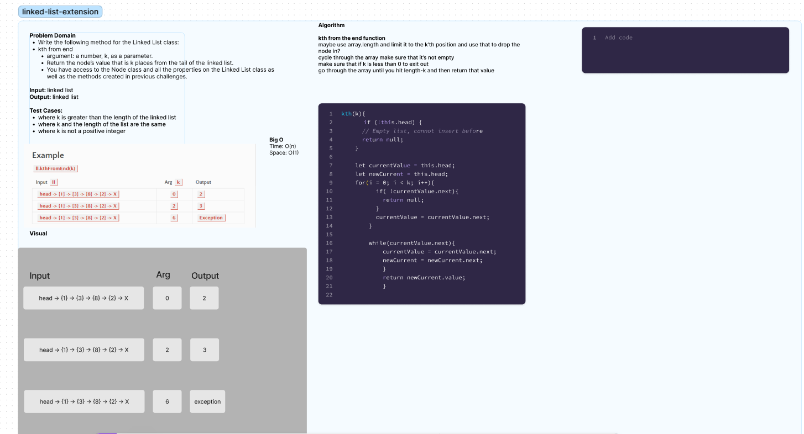

# Code Challenge 6

## Whiteboard

## Collaborators
Code Challenge 6:

I worked with Mike (Ike) on the process for the whiteboard and getting the code. We used the base of the traversal function that was written out in the Demo for code challenge 4. I tried to figure this out for a while on my own (the hour had based to work on with Ike). I checked back in with him later and he explained what Josh Coffey had talk to him about. This was an interest and challenging one for sure.

Code Challenge 7:

I worked with Nick Mullaney today of getting the code we needed.
We consulted Chatgpt to help us formulate the testing.

Prompts for Chatgpt:

"please help me write a test for a linkedList that uses the below insertBefore code to ensure that a node is inserted before a node located in the middle of a linked list

for the above code can you please help me write a comprehensive list of tests for the following criteria, using javascript and I prefer to use 'it' over test Unit Tests Write tests for the following scenarios, and any other cases that help you ensure your code is working as expected.

Where k is greater than the length of the linked list Where k and the length of the list are the same Where k is not a positive integer Where the linked list is of a size 1 “Happy Path” where k is not at the end, but somewhere in the middle of the linked list" 
