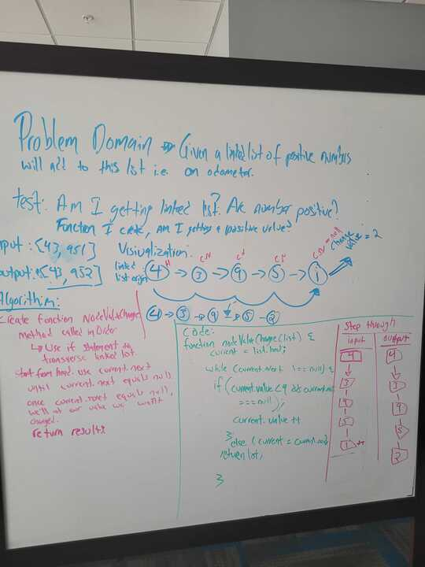

# Problem Domain

For my final whiteboard interview I was asked that give a linked list of positive numbers to create a function that will increase the value of the last node in the list by one, i.e. an odometer.

## Additonal Information

Test Cases: This function would not work for negative numbers, decimals, empty or null list, nor unorder lists.

BigO:
Time: O(n)
Space: O(1)

Alternative Ways:
Another way that I could have achieved this is byt reversing the linked list so that the value we wanted changed would be at the head of list. This way I would have a function that could be used in a more widely used areas, for example the given test cases that this funciton would not pass. The above function would also struggle with if the value was a 9 and needed to be change in a 10, it would not carry the one over to the next node value and change. So I would have to add or create another method/function in that case.
